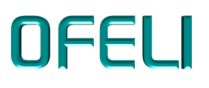

# Ofeli - An Object Oriented Finite Element Library


OFELI is an object oriented library of C++ classes for development of finite element codes.

Its main features are:
* Various storage schemes of matrices (dense, sparse, skyline).
* Direct methods of solution of linear systems of equations as well as
  various combinations of iterative solvers and preconditioners.
* Shape functions of most "popular" finite elements
* Element arrays of most popular problems (Heat Transfer, Fluid Flow, Solid
  Mechanics, Electromagnetics, ...).

The OFELI package is not only a library of classes for Finite Element developments.

The package contains in addition :
* Very simple examples for "academic" finite element codes
* More elaborated codes for various types of problems
* Utility programs to convert mesh and output files and to generate simple meshes

OFELI is free but Copyrighted software. It is distributed under the
terms of the GNU General Public License (GPL). Details of the GPL are in
the [COPYING.txt](https://github.com/rtouzani/ofeli/blob/master/COPYING) file that comes with the OFELI software package.

## Requirements
- Cmake >= 3.16

## Build
```bash
mkdir build && cd build
cmake ..
make -j$(nproc)
```

## Install
```bash
make install
```

> **NOTE:**  If you want to modify the installation destination, specify the following macros at build step:
>
> - CMAKE_INSTALL_LIBDIR
>
> - CMAKE_INSTALL_BINDIR
>
> - CMAKE_INSTALL_INCLUDEDIR
>
> Example: 
>```bash
>   cmake .. \
>       -DCMAKE_INSTALL_LIBDIR=/path/to/libdir \
>       -DCMAKE_INSTALL_BINDIR=/path/to/bindir \
>       -DCMAKE_INSTALL_INCLUDEDIR=/path/to/includedir
>```
>After this you should be able to install the library with the `make install` command in you desired location.

